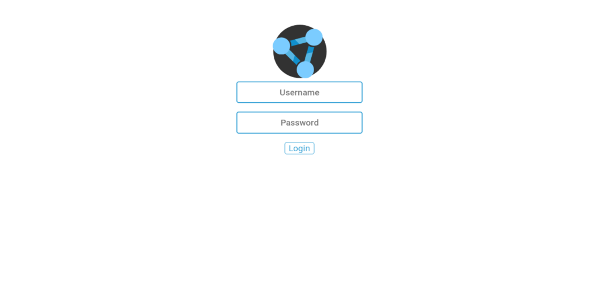
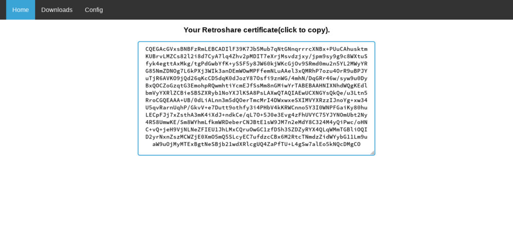
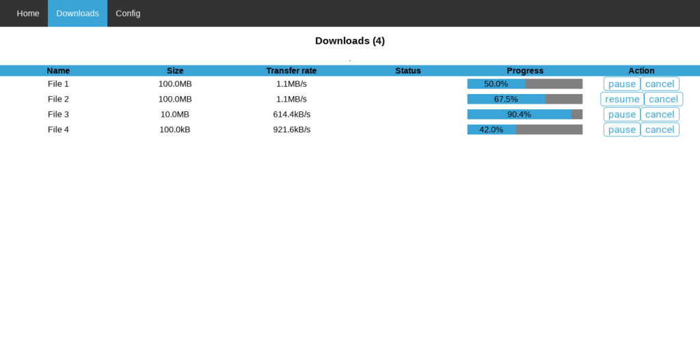

+++
title = "Web Interface for Retroshare - Update 1"
description = "Update on the development process of Retroshare's new web interface."
date = 2019-06-23
slug = "retroshare-update-2"
+++

> This is a mirror of a [post](https://blog.freifunk.net/2019/06/23/web-interface-for-retroshare-update-1/) I wrote on the [Freifunk blog](https://blog.freifunk.net).

Since the [first post](https://blog.freifunk.net/2019/05/23/a-new-web-interface-for-retroshare/), there has been quite a lot of progress on development of the new Web Interface for Retroshare.

As the build process is not using any JavaScript-specific tools, I spent a lot of time making sure that the development process was made as streamlined as possible.
All the components are logically isolated and functionality moved to their relevant places.
Using [mithril](https://mithril.js.org/) also helped a lot, which has this concept of [components](https://mithril.js.org/components.html), a mechanism to encapsulate different parts of views.
Which massively helps in project organization and code reuse.

One more important feature which was completed is automatic data refresh and redrawing of views.
I decided to use a combination of mithril’s [lifecycle methods](https://mithril.js.org/lifecycle-methods.html) and JavaScript’s browser `setTimeout` method that can be used to create background tasks which when attached to their respective components, will periodically fetch and refresh data.
The background task gets activated whenever a component’s view is rendered and gets killed when a component goes off of display.
Mithril also has it’s own [auto-redraw](https://mithril.js.org/autoredraw.html) system which refreshes views when a component’s event handlers are called.
But it does not refresh when component attributes are updated, or when raw promises are resolved.

Here are a few screenshots displaying the new UI style:

## Next Steps

Along with the goals displayed in the first post, these will be given a higher priority for completion during the coming phase leading up to the next evaluation:

- Node panel in config tab for handling most(if not all) network settings like node information, Net mode, NAT, Download limits, ports, etc.
- Shares panel showing shared files, allowing to edit them, set view permissions, among other options.
- Peers tab to display connected peers and set their reputations.
- Modify the main Retroshare client to enable/disable the WebUI.
