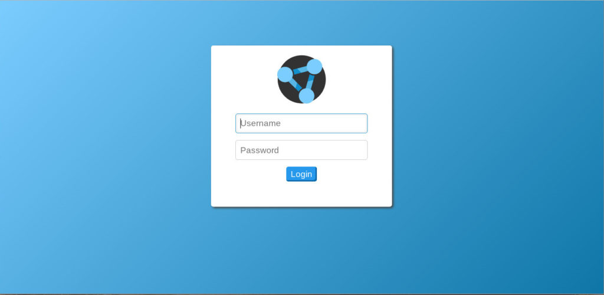
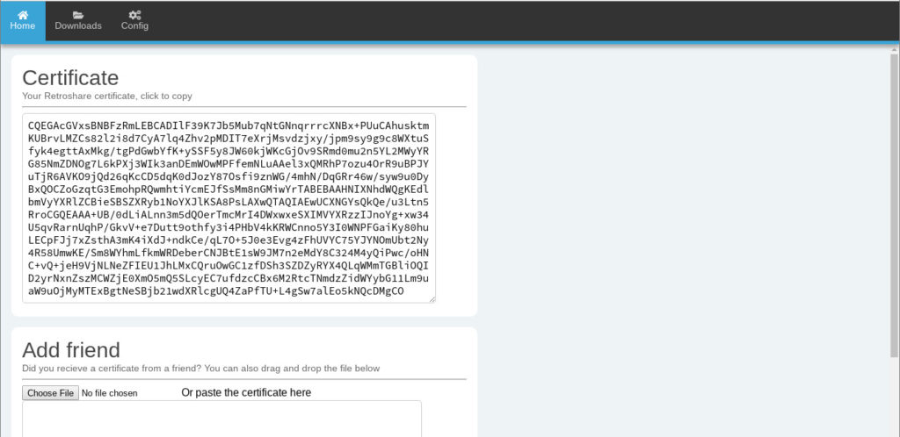
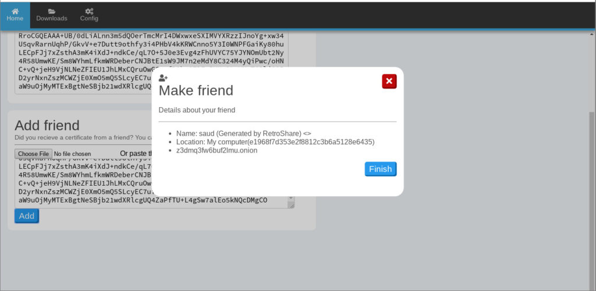
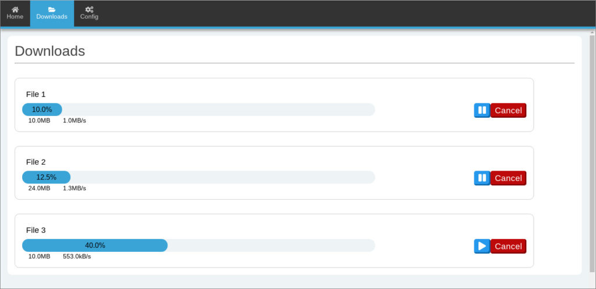
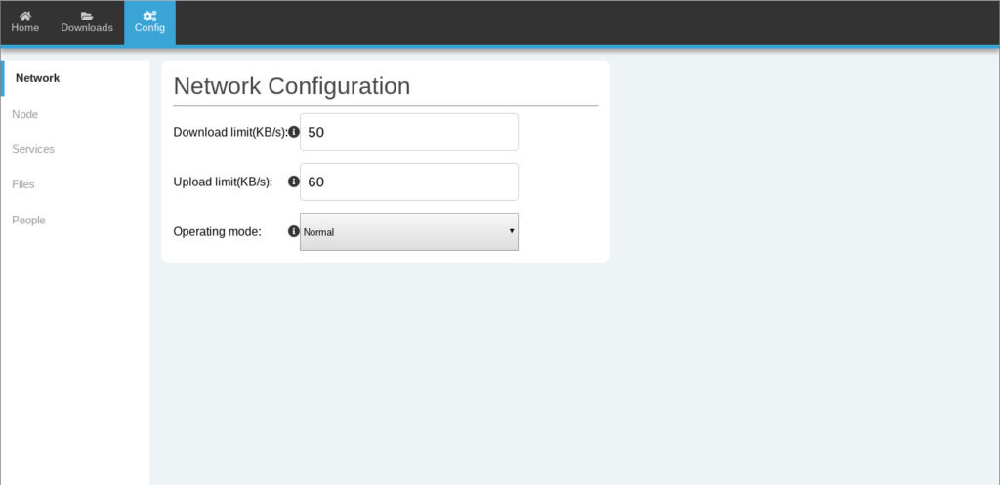
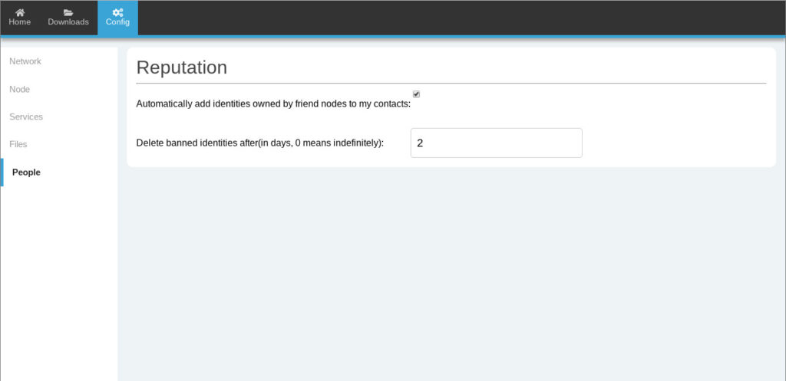
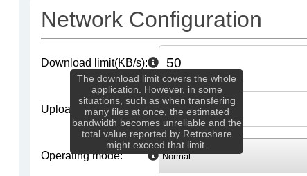

+++
title = "Web Interface for Retroshare - Update 2"
description = "Second progress update. More details about the revamped UI."
date = 2019-07-24
slug = "retroshare-update-3"
+++

> This is a mirror of a [post](https://blog.freifunk.net/2019/07/22/web-interface-for-retroshare-update-2/) I wrote on the [Freifunk blog](https://blog.freifunk.net).

I Realized that the visual appearance of the application felt very bland and uninteresting, so I decided to shift some of my focus to the design and visual aspect of the UI.
I did plenty of reading about UI/UX design principles and modern best practices during this time.
And looks like it turned out pretty well, and is definitely a good improvement from the [previous](https://blog.freifunk.net/2019/06/23/web-interface-for-retroshare-update-1/) appearance.
Also, since this is my first attempt at doing professional-level UX design, there is probably room for improvement, so feedback and suggestions are always welcome.

The general theme has been redone from scratch. I chose this soft blue color palette by taking inspiration from the main app’s look:

The home tab, along with displaying the user certificate, now also allows to add friends by using their certificates.
It is possible to add friends by copying the certificate contents, dragging and dropping the file, or simply selecting it from the file manager.

Implemented modal messages within the browser that can be used as a popup dialogue box to display any kind of information (here showing information extracted from a Retroshare certificate):

As you can see, the navbar has also been revamped.
And the best thing about it? Icons! I along with my mentors agreed on using the [Font Awesome](https://fontawesome.com/) icon library, which is open source (licensed with a combination of MIT, CC 4.0 & OFL 1.1 licenses).
I can now utilize icons across the whole app.

The downloads tab has also been redesigned.
Now showing all downloads in a slightly different way.
This layout was chosen with extensibility in mind, it can easily be extended to contain a additional file-related settings and chunk views by having an expandable options box for each file.

The config tab can now be used to change a lot of the setting options similar to the main app.
Network, node, services, files and people sections from the app have been implemented.
I will shortly finish the remaining sections too.

Also notice the tooltip icon. Which when hovered on, gives a brief description about the option. Just like in Retroshare:

## Next Steps

Now that the design is steadily making way for a more detailed and specialized variety of widgets and components, I am working on creating tabs for Network, People, Chats, Mail, Channels & Forums so that the Web Interface can finally become a fully usable alternative to the main client app.

You can try out the Web Interface by cloning it from the repository: [https://github.com/RetroShare/RSNewWebUI](https://github.com/RetroShare/RSNewWebUI), and my fork: [https://github.com/rottencandy/RSNewWebUI](https://github.com/rottencandy/RSNewWebUI).
Again, I am always happy to receive feedback and suggestions for improving the Web Interface.
