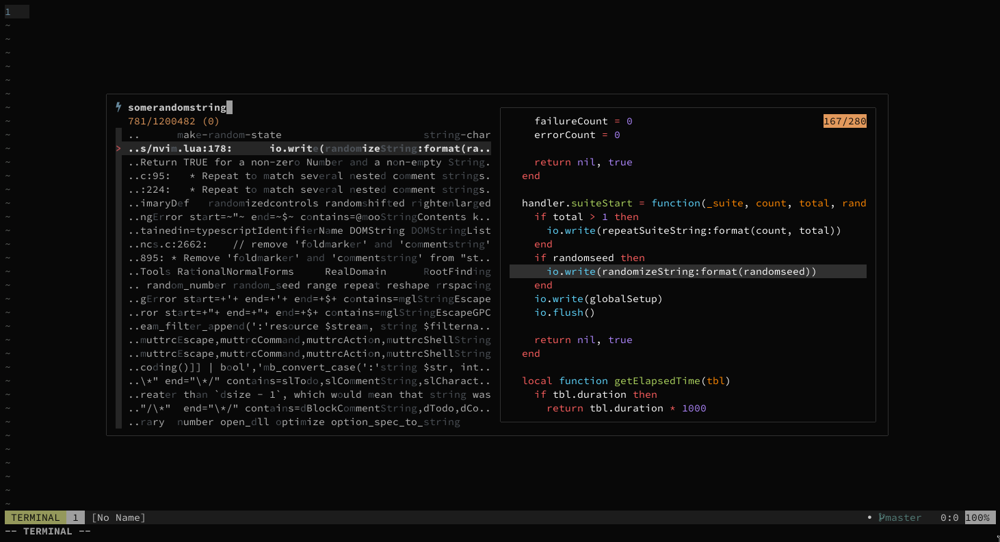

+++
title = "Quick & dirty project-wide fuzzy search in vim"
description = "Fuzzy searching in vim, the worst possible way."
date = 2021-06-10
+++

The most common method of searching files for text using vim is with the `:grep` command.
It conveniently fills up the quickfix list with all files containing matches, allowing easy navigation.
Moreover, it can be configured with the `grepprg` option to use any grep program to do the searching.

But lately, I've developed this habit of sticking [fzf](https://github.com/junegunn/fzf) into any scripts or aliases I make.
Fuzzy searching is my guilty pleasure.
The instant gratification I get fuzzy searching through all possible results,
along with the immediate visual feedback as I narrow down to desired matches,
even though it may not always be the fastest/most efficient way,
gives me _warm fuzzy feelings_.

Naturally, I decided to see if the idea of fuzzy matching would be usable for doing project-wide searches in vim,
similar to `:grep` but more interactive.

## Basic fuzzy searching on the CLI

The way `fzf` works is by reading all possible matches as input,
and then it allows narrowing down to desired results by filtering through them.

I want to search through all files recursively under the currently active directory,
so we can just `cat` all the files and pass them to `fzf`, like:
```sh
$ find ./ -exec cat {} \; | fzf
#(...)
matched_text # output after fzf selection
```
But I don't really want to search through all the ignored and hidden files,
we need a way to exclude them from our output.
What if we instead use [ripgrep](https://github.com/BurntSushi/ripgrep)?
```sh
$ cd ~/code/dotfiles
$ rg --line-number '.*' | fzf
#(...)
gitconfig:21:  line-numbers = true
```
This makes it much simpler,
we match _"everything"_ using `.*`, and pass it all to `fzf`.
Since `rg` searches recursively by default, we don't have to worry about using `find` either.

The output also provides the line number, which is enabled using the `--line-number` option.
Note that the result uses the format `{FILE_PATH}:{LINE_NUMBER}: {MATCHED_TEXT}`.

Now let's use this in vim.

## Using fzf with vim

When `fzf` is installed correctly, it comes with a little [vim wrapper](https://github.com/junegunn/fzf/blob/master/README-VIM.md) that lets us integrate the command using vimscript.

The core function that enables this is `fzf#run`, which takes in the source and provides the result to a sink:
```vim
nnoremap <silent> <Leader>s :call fzf#run({
  \ 'source': 'rg --line-number ''.*''',
  \ 'sink': function('<sid>sinkFunction'),
})<CR>
```
This may look intimidating if you're new to vimscript, but it's really simple.
We create a key mapping which calls `fzf#run` with the source as `rg --line-number ''.*''`(The `''` is just vim's way of escaping quotes inside strings),
and a sink function `sinkFunction` that the result is passed to.

Let's define the sink function to open the file from the provided result:
```vim
fun! s:sinkFunction(result)
  let filePath = split(a:result, ':')
  exec 'edit +' . l:filePath[1] . ' ' . l:filePath[0]
endfun
```
The file path and line number is extracted from the result by splitting it into multiple strings at the `:` points.

We then use this to create and run the command to load a file at a given line,
which is in the format `edit +{LINE_NUMBER} {FILE_PATH}`.

And it works!
The fzf wrapper even seems to handle the case where I use multiple selections and opens multiple files accordingly.

I honestly wasn't expecting it to be that simple.
And so, as if in a fit of rage due to this anti-climatic moment,
I decided to see if I could do more here.

We're already wasting so many CPU cycles, why not go a little further and make everything look fancy?

## File previews

Fzf has this `--preview` option, that when supplied with a command, shows it's output in a little window as we go through the results.
And this works in vim too, we could use this to show a preview of the file that's currently being searched.
```vim
nnoremap <silent> <Leader>s :call fzf#run({
  \ 'source': 'rg --line-number ''.*''',
  \ 'options': '--delimiter : --preview "bat --color=always {1} -H {2}" --preview-window "+{2}/2"',
  \ 'sink': function('<sid>sinkFunction'),
  \ })<CR>
```
The `fzf#run` function also takes in extra `options` that get passed to `fzf`,
and here we use [bat](https://github.com/sharkdp/bat) to preview the file in all it's syntax-highlighted glory.

We can also make `bat` highlight the matching line, and make `fzf` scroll the preview window to the line.

The overall result feels really fast and snappy, even on large codebases.
Here's me casually browsing the neovim codebase:


## Conclusion

I will probably get bored of this very quickly.
Largely because `fzf` has limited support for pattern matching (although the exact-match mode using `'` is quite handy),
and this method lacks the persistence of the quickfix list.

But this is still something I'd use when I'm too lazy to `:grep`,
and just want to immediately jump to a location that pops into my mind.

Here's a slightly cleaned up version, if you'd like to try it:
```vim
fun! s:openFileAtLocation(result)
  if len(a:result) == 0
    return
  endif
  let filePos = split(a:result, ':')
  exec 'edit +' . l:filePos[1] . ' ' . l:filePos[0]
endfun

nnoremap <silent> <Leader>s :call fzf#run(fzf#wrap({
  \ 'source': 'rg --line-number ''.*''',
  \ 'options': '--delimiter : --preview "bat --style=plain --color=always {1} -H {2}" --preview-window "+{2}/2"',
  \ 'sink': function('<sid>openFileAtLocation'),
  \ }))<CR>
```
